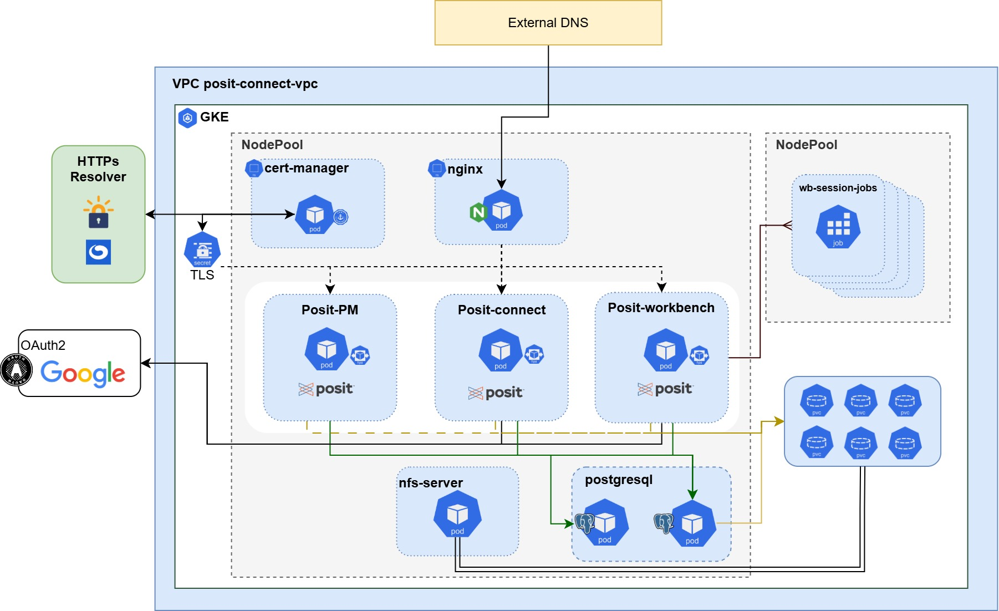
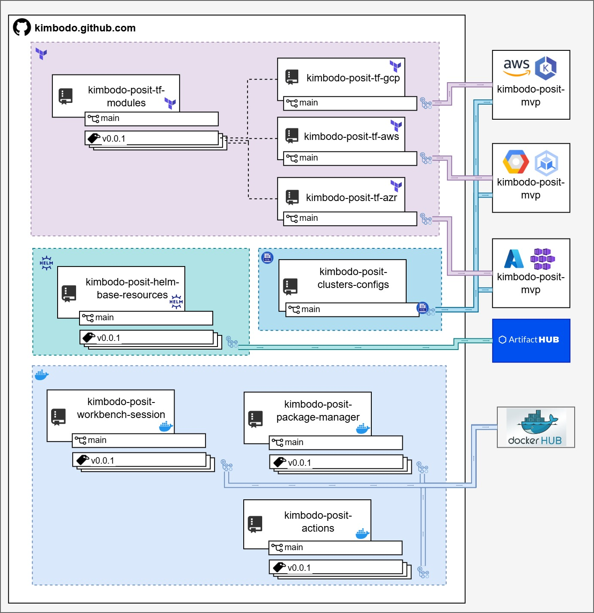

# Kimbodo Posit GCP installation (internal runbook)

This tutorial demonstrates **how to install Posit Workbench, Posit Connect, and Posit Package Manager on a GKE cluster**, In addition to the official Posit Helm charts, we’ll also use the [kimbodo-posit-base-resources](https://artifacthub.io/packages/helm/kimbodo-posit-base-resources/kimbodo-posit-base-resources) Helm chart. This chart sets up essential infrastructure components such as the base Ingress, HPA, NFS, and database required by all three tools.

## **Architecture Overview**

This document outlines the architecture and operational components of the Posit ecosystem deployed on Google Kubernetes Engine (GKE) within the a VPC both installed by terraform. The system includes the main Posit tools: **Posit Workbench**, **Posit Connect**, and **Posit Package Manager**, along with supporting services such as PostgreSQL, NFS, NGINx, and TLS automation.



#### 1. Core Infrastructure

- **Cloud Platform**: Google Cloud Platform (GCP)
- **Kubernetes Cluster**: Google Kubernetes Engine (GKE)
- **Virtual Private Cloud (VPC)**: isolating internal communication
- **Node Pools**:
  - **General purpose node pool**: Runs core components
  - **Dedicated node pool**: Runs interactive job workloads (Posit Workbench sessions)

---

#### 2. Posit Components

| Component         | Description |
|------------------|-------------|
| [**Posit Workbench**](https://docs.posit.co/ide/server-pro/) | Interactive development environment (e.g., RStudio, Jupyter) |
| [**Posit Connect**](https://docs.posit.co/connect/user/)   | Hosting and publishing platform for R/Python/Shiny/Quarto apps |
| [**Posit Package Manager (PM)**](https://packagemanager.posit.co/__docs__/admin/) | Internal package repository manager for R, Python, and system packages |

Each of these components is deployed as a Kubernetes **pod**.

---
#### 3. Ingress & Security

| Component | Role |
|----------|------|
| **NGINX Ingress Controller** | Entry point for HTTPS traffic into the cluster |
| **cert-manager** | Automates TLS certificate issuance and renewal |
| **HTTPS Resolver (e.g., Let’s Encrypt)** | Provides TLS certificates to `cert-manager` |
| **Google OAuth2** | Identity provider for user authentication into Posit apps |

- TLS secrets generated by `cert-manager` are used by NGINX to enable secure HTTPS communication.
- Authentication is handled using Google’s OAuth2, allowing SSO integration.

---

#### 4. Workload Management

- Posit Workbench sessions spawn **job pods** in a separate node pool to isolate resource consumption.
- These workloads are short-lived, tied to user sessions, and automatically cleaned up afterward.

---

#### 5. Benefits of This Architecture

- **Scalability**: Independent node pools scale based on workload type (apps vs. sessions)
- **Security**: TLS encryption, OAuth2 authentication, and network isolation via VPC
- **Modularity**: Each service is loosely coupled and easily manageable
- **Automation**: DNS, certificates, and updates are handled automatically
- **Resilience**: Kubernetes-native deployment ensures high availability and failover

---

## **GCP Project Setup for Terraform Infrastructure Management**

This guide outlines the required steps to prepare a new Google Cloud Platform (GCP) project for managing infrastructure using **Terraform**. It covers:

- Creating a GCS bucket to store Terraform state
- Creating and configuring a Service Account
- Assigning the necessary IAM roles
- Enabling required APIs

---

### 1. Create a GCP Project

If not already done, create a new GCP project:

```bash
gcloud projects create [PROJECT_ID] --name="[PROJECT_NAME]"
gcloud config set project [PROJECT_ID]
```

---

### 2. Create a GCS Bucket for Terraform State

```bash
gsutil mb -p [PROJECT_ID] -c STANDARD -l [REGION] gs://[UNIQUE_BUCKET_NAME]/
gsutil versioning set on gs://[UNIQUE_BUCKET_NAME]
```

- The bucket name must be globally unique.
- Versioning is recommended for Terraform state recovery.

---

### 3. Create the Terraform Service Account

```bash
gcloud iam service-accounts create terraform --display-name "Terraform admin SA"
```

Then create and download the credentials file:

```bash
gcloud iam service-accounts keys create terraform-sa.json \
  --iam-account terraform@[PROJECT_ID].iam.gserviceaccount.com
```

---

### 4. Assign Required IAM Roles

Grant the Service Account the following roles:

```bash
gcloud projects add-iam-policy-binding [PROJECT_ID] \
  --member="serviceAccount:terraform@[PROJECT_ID].iam.gserviceaccount.com" \
  --role="roles/owner"
```

> You can restrict the permissions more finely if needed:

- `roles/compute.admin`
- `roles/container.admin`
- `roles/resourcemanager.projectIamAdmin`
- `roles/iam.serviceAccountUser`
- `roles/servicenetworking.networksAdmin`
- `roles/compute.networkAdmin`
- `roles/compute.securityAdmin`
- `roles/compute.addressAdmin`
---

### 5. Enable Required APIs

Before using Terraform to manage resources, enable these APIs:

```bash
gcloud services enable \
  compute.googleapis.com \
  container.googleapis.com \
  iam.googleapis.com \
  cloudresourcemanager.googleapis.com \
  serviceusage.googleapis.com \
  dns.googleapis.com
```

You can run them in one command as shown above.

---

###  6. Authenticate Terraform with the Service Account

Export the credentials before running Terraform:

```bash
export GOOGLE_APPLICATION_CREDENTIALS="./terraform-sa.json"
```

Then you can run:

```bash
terraform init
terraform plan
terraform apply
```

---

### 7. Checklist

You can run the following commands to confirm the setup:

```bash
# 1. Verify the GCS bucket exists
gsutil ls -p $PROJECT_ID

# 2. Check if bucket versioning is enabled
gsutil versioning get gs://$BUCKET_NAME

# 3. List enabled APIs
gcloud services list --enabled --project $PROJECT_ID

# 4. Validate service account existence
gcloud iam service-accounts list --project $PROJECT_ID

# 5. Check IAM roles attached to the service account
gcloud projects get-iam-policy $PROJECT_ID \
  --flatten="bindings[].members" \
  --format='table(bindings.role)' \
  --filter="bindings.members:terraform@$PROJECT_ID.iam.gserviceaccount.com"

# 6. Test credentials file (optional: set GOOGLE_APPLICATION_CREDENTIALS to path)
export GOOGLE_APPLICATION_CREDENTIALS="$(pwd)/terraform-sa.json"
gcloud auth activate-service-account --key-file=$GOOGLE_APPLICATION_CREDENTIALS
```
---

## **Provisioning New GCP Environments with Terraform**

To provision a new GCP environme nt that supports the Posit ecosystem (Workbench, Connect, Package Manager), use the Terraform project available at:

[**kimbodo-posit-tf-gcp**](https://github.com/ValcirJRKimbodo/kimbodo-posit-tf-gcp)

This repository contains reusable modules that came from [kimbodo-tf-multicloud-modules](https://github.com/nkopskimbodo/kimbodo-tf-multicloud-modules) and environment-specific configurations to create:

- VPCs
- Subnets
- GKE clusters -
- Node pools
- Reserved static IPs for ingress

---

### **Repository Structure**

```
kimbodo-posit-tf-gcp/
├── envs/
    ├── dev-gcp/              # Dev environment (example)
    |  ├─ main.tf
    |  ├─ backend.tf
    |  ├─ versions.tf
    |  ├─ terraform.tfvars
    └── [new-env]/            # Create new environment folders here
```

---

### **Steps to Create a New Environment**

#### 1. **Clone the Repository**

```bash
git clone https://github.com/ValcirJRKimbodo/kimbodo-posit-tf-gcp.git
cd kimbodo-posit-tf-gcp/envs
```

#### 2. **Create a New Folder for Your Environment**

```bash
cp -r dev-gcp new-env-gcp
cd new-env-gcp
```

Customize the `terraform.tfvars` file with values like:

- `project_id` -> your GCP project name created before
- `region` --> one that you choose to your project, default is us-central1
- And others as needed

#### 3. **Configure Credentials and Initialize Terraform**

Export your GCP credentials, using the terraform created at the GCP project setup:

```bash
export GOOGLE_APPLICATION_CREDENTIALS="./terraform-sa.json"
```

Initialize and apply on your environments folder:

```bash
terraform init
terraform plan
terraform apply
```

This will provision all the required cloud infrastructure for your Posit applications.

---

### ✅ Final Checklist

Run these after provisioning:

```bash
# Check GKE cluster
gcloud container clusters list --project=$PROJECT_ID

# Confirm IPs and DNS are created
gcloud compute addresses list --project=$PROJECT_ID
gcloud dns managed-zones list --project=$PROJECT_ID

# Validate node pools
gcloud container node-pools list --cluster=[CLUSTER_NAME] --project=$PROJECT_ID
```

---


## **Deploying Posit with Helmfile on GKE**

After the infrastructure (VPC, GKE, IPs, DNS) has been provisioned via Terraform, you can deploy the Posit stack (Workbench, Connect, and Package Manager) on the cluster using **Helmfile**.

The configuration repository is:  
[**kimbodo-posit-clusters-configs**](https://github.com/ValcirJRKimbodo/kimbodo-posit-clusters-configs).

---

### **1. Connecting to the GKE Cluster**

Fetch the cluster credentials:

```bash
gcloud container clusters get-credentials [CLUSTER_NAME]   --region [REGION]   --project [PROJECT_ID]
```

Verify the connection:

```bash
kubectl get nodes
```

---

### **2. Installing Local Dependencies**

Ensure you have the following tools installed:

- **kubectl** (version compatible with GKE cluster)
- **Helm** (>= 3.14)
- **Helmfile** (>= 0.160)

On Linux or WSL:

```bash
curl -LO https://get.helm.sh/helm-v3.14.0-linux-amd64.tar.gz
tar -zxvf helm-v3.14.0-linux-amd64.tar.gz
sudo mv linux-amd64/helm /usr/local/bin/

# Install Helmfile
curl -L https://github.com/helmfile/helmfile/releases/download/v0.160.0/helmfile_0.160.0_linux_amd64.tar.gz | tar xz
sudo mv helmfile /usr/local/bin/
```

---

### **3. Cloning the Configuration Repository**

```bash
git clone https://github.com/ValcirJRKimbodo/kimbodo-posit-clusters-configs.git
cd kimbodo-posit-clusters-configs
```

---

### **4. Adjusting `values`**

Within the repository, the configuration values are located under `values-environments/`.

- Each environment has its own files (e.g., `values-environments/mvp-gcp/global.yaml`).
- Update domains, OAuth credentials, and other parameters as required.

Domain adjustment example:

```yaml
global:
  domain: posit01gcp.yourdomain.com
```

---

### **5. Testing Helmfile Render**

Before applying, check if the templates are valid:

```bash
helmfile -e mvp-gcp template
```

If everything looks correct, proceed with the deployment.

---

### **6. Deploying with Helmfile**

To deploy all components:

```bash
helmfile -e mvp-gcp sync
```

The `-e mvp-gcp` flag specifies the environment. For a different environment, create a new `values-environments/[env]/global.yaml` file and reference it in the `helmfile.yaml`.

---

### **7. Verifying the Deployment**

```bash
kubectl get pods -A
kubectl get ingress -A
```

Wait until all pods have `STATUS=Running` and ingresses have external IPs assigned.

---

### **8. Post-Deployment Checklist**

```bash
# Check issued TLS certificates
kubectl get certificate -A

# Check services
kubectl get svc -A

# Test URLs for Posit Workbench, Connect, and Package Manager
```
---

## **Using GitHub Actions to deploy your applications**

After setting up all these projects, you can use GitHub Actions to deploy them. Let’s take an overview of the repository architecture diagram.

### Github Architecture Diagram Overview

This diagram shows the DevOps architecture of the Kimbodo-Posit project, highlighting how infrastructure and apps are managed:



|Section|Description|
|---|---|
|Terraform (purple):| Repos like kimbodo-posit-tf-gcp, -aws, -azr deploy cloud resources (AWS, GCP, Azure) using shared tf-modules. Repos like kimbodo-posit-tf-gcp, -aws, -azr deploy cloud resources (AWS, GCP, Azure) using shared tf-modules.
|Helm & Kubernetes (blue & green middle section):| kimbodo-posit-helm-base-resources and kimbodo-posit-clusters-configs define base cluster configs and Helm charts.|
|Applications (bottom):| Charts for Posit tools (workbench-session, package-manager) and custom GitHub Actions (kimbodo-posit-actions).|
|External Registries:| ArtifactHub (Helm charts) and Docker Hub (images).|

It maps how code, infrastructure, and apps are versioned, deployed, and published in a multi-cloud environment.
